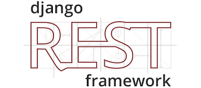

<div id="top"></div>
<!--
*** Thanks for checking out the Best-README-Template. If you have a suggestion
*** that would make this better, please fork the repo and create a pull request
*** or simply open an issue with the tag "enhancement".
*** Don't forget to give the project a star!
*** Thanks again! Now go create something AMAZING! :D
-->

<!-- PROJECT SHIELDS -->

<!--
*** I'm using markdown "reference style" links for readability.
*** Reference links are enclosed in brackets [ ] instead of parentheses ( ).
*** See the bottom of this document for the declaration of the reference variables
*** for contributors-url, forks-url, etc. This is an optional, concise syntax you may use.
*** https://www.markdownguide.org/basic-syntax/#reference-style-links
-->


<!-- PROJECT LOGO -->

<br />
<div align="center">
  <a href="https://github.com/potlitel/Superhero-DRF">
    
  </a>

<h3 align="center">Superheros API - Django Rest Framework</h3>

<p align="center">
    project_description
    <br />
    <a href="https://github.com/potlitel/Superhero-DRF"><strong>Explore the docs »</strong></a>
    <br />
    <br />
    <a href="https://github.com/potlitel/Superhero-DRF">View Demo</a>
    ·
    <a href="https://github.com/potlitel/Superhero-DRF">Report Bug</a>
    ·
    <a href="https://github.com/potlitel/Superhero-DRF/issues">Request Feature</a>
  </p>
</div>

<!-- TABLE OF CONTENTS -->

<details>
  <summary>Table of Contents</summary>
  <ol>
    <li>
      <a href="#about-the-project">About The Project</a>
      <ul>
        <li><a href="#built-with">Built With</a></li>
      </ul>
    </li>
    <li>
      <a href="#getting-started">Getting Started</a>
      <ul>
        <li><a href="#prerequisites">Prerequisites</a></li>
        <li><a href="#installation">Installation</a></li>
      </ul>
    </li>
    <li><a href="#usage">Usage</a></li>
    <li><a href="#roadmap">Roadmap</a></li>
    <li><a href="#contributing">Contributing</a></li>
    <li><a href="#license">License</a></li>
    <li><a href="#contact">Contact</a></li>
    <li><a href="#acknowledgments">Acknowledgments</a></li>
  </ol>
</details>

<!-- ABOUT THE PROJECT -->

## About The Project


Here's a blank template to get started: To avoid retyping too much info. Do a search and replace with your text editor for the following: `github_username`, `repo_name`, `twitter_handle`, `linkedin_username`, `email_client`, `email`, `project_title`, `project_description`

<p align="right">(<a href="#top">back to top</a>)</p>

### Built With

* [Django](https://www.djangoproject.com/)
* [Django Rest Framework](https://www.django-rest-framework.org/)

<p align="right">(<a href="#top">back to top</a>)</p>

<!-- GETTING STARTED -->

## Getting Started

This repo is a rich clone of [Creating a REST Web API in C# with ASP.NET Core 5.0 and Visual Studio Code](https://luis-hernandez.medium.com/creating-a-rest-web-api-in-c-with-asp-net-core-5-0-and-visual-studio-code-809ea7b4f815). Is an step-by-step guide to show you how to create a REST Web API in C# with ASP.NET Core 5.0 and Visual Studio Code. And how test it using either Swagger or a REST Client extension..

### Prerequisites

1. First you need to check if you have installed the .NET Core 6.0 SDK with the following .NET CLI (Command-Line Interface) command:

      ```sh
      dotnet --version
      ```
    If your version is not 5 or above, [download the .NET Core 6.0 SDK](https://dotnet.microsoft.com/en-us/download/dotnet/6.0) and install it on your machine.

2. Install Visual Studio Code editor (also know as VSCode).

3. Once Visual Studio Code is open, install the REST Client extension.

4. Finally, install the C# extension to get IntelliSense features in VSCode.

### Installation

1. Clone the repo
   ```sh
   git clone https://github.com/potlitel/Superhero-DRF.git
   ```
2. Running the project
   ```js
   dotnet watch run
   ```

<p align="right">(<a href="#top">back to top</a>)</p>

### 🐳 Installation using Docker
#### Why Docker

Docker helps developers build and ship higher-quality applications, faster." -- [What is Docker](https://www.docker.com/what-docker#copy1)

#### Prerequisites

#### Linux

The 3.10.x kernel is [the minimum requirement](https://docs.docker.com/engine/installation/binaries/#check-kernel-dependencies) for Docker.

#### MacOS

10.8 “Mountain Lion” or newer is required.

#### Windows 10

Hyper-V must be enabled in BIOS

VT-D must also be enabled if available (Intel Processors).

#### Windows Server

Windows Server 2016 is the minimum version required to install docker and docker-compose. Limitations exist on this version, such as multiple virtual networks and Linux containers. Windows Server 2019 and later are recommended. 

#### Installation
#### Linux

Run this quick and easy install script provided by Docker:

```sh
curl -sSL https://get.docker.com/ | sh
```

If you're not willing to run a random shell script, please see the [installation](https://docs.docker.com/engine/installation/linux/) instructions for your distribution.

If you are a complete Docker newbie, you should follow the [series of tutorials](https://docs.docker.com/engine/getstarted/) now.

#### macOS

Download and install [Docker Community Edition](https://www.docker.com/community-edition). if you have Homebrew-Cask, just type `brew install --cask docker`. Or Download and install [Docker Toolbox](https://docs.docker.com/toolbox/overview/).  [Docker For Mac](https://docs.docker.com/docker-for-mac/) is nice, but it's not quite as finished as the VirtualBox install.  [See the comparison](https://docs.docker.com/docker-for-mac/docker-toolbox/).

> **NOTE** Docker Toolbox is legacy. You should to use Docker Community Edition, See [Docker Toolbox](https://docs.docker.com/toolbox/overview/).
Once you've installed Docker Community Edition, click the docker icon in Launchpad. Then start up a container:

```sh
docker run hello-world
```

That's it, you have a running Docker container.

If you are a complete Docker newbie, you should probably follow the [series of tutorials](https://docs.docker.com/engine/getstarted/) now.

#### Windows 10

Instructions to install Docker Desktop for Windows can be found [here](https://docs.docker.com/desktop/windows/install/)

Once installed, open powershell as administrator and run:

```powershell
# Display the version of docker installed:
docker version
# Pull, create, and run 'hello-world':
docker run hello-world
```

To continue with this cheat sheet, right click the Docker icon in the system tray, and go to settings. In order to mount volumes, the C:/ drive will need to be enabled in the settings to that information can be passed into the containers (later described in this article). 

To switch between Windows containers and Linux containers, right click the icon in the system tray and click the button to switch container operating system Doing this will stop the current containers that are running, and make them unaccessible until the container OS is switched back.

Additionally, if you have WSL or WSL2 installed on your desktop, you might want to install the Linux Kernel for Windows. Instructions can be found [here](https://techcommunity.microsoft.com/t5/windows-dev-appconsult/using-wsl2-in-a-docker-linux-container-on-windows-to-run-a/ba-p/1482133). This requires the Windows Subsystem for Linux feature. This will allow for containers to be accessed by WSL operating systems, as well as the efficiency gain from running WSL operating systems in docker. It is also preferred to use [Windows terminal](https://docs.microsoft.com/en-us/windows/terminal/get-started) for this.

#### Windows Server 2016 / 2019

Follow Microsoft's instructions that can be found [here](https://docs.microsoft.com/en-us/virtualization/windowscontainers/deploy-containers/deploy-containers-on-server#install-docker)

If using the latest edge version of 2019, be prepared to only work in powershell, as it is only a servercore image (no desktop interface). When starting this machine, it will login and go straight to a powershell window. It is reccomended to install text editors and other tools using [Chocolatey](https://chocolatey.org/install).

After installing, these commands will work:

```powershell
# Display the version of docker installed:
docker version
# Pull, create, and run 'hello-world':
docker run hello-world
```

Windows Server 2016 is not able to run Linux images. 

Windows Server Build 2004 is capable of running both linux and windows containers simultaneously through Hyper-V isolation. When running containers, use the ```--isolation=hyperv``` command, which will isolate the container using a seperate kernel instance. 

#### 👷‍♀ Let's build the image using Dockerfile

We can now build this image in a simple way running the followind command

```powershell
docker build -t djangosuperheros:1.1 .
```

Note that djangosuperheros is the name of the image, and using :1.1 can be anything like an example docker build -t djangosuperheros:1.1 .

This will create an image called djangosuperheros and be version 1.1

Now go get some ☕️ and 💺 while 🐳 does its magic 🐳 = ❤️

Once this is completed as it can take a bit of time (Normally a few minutes ☕️) then we can run our project using the following command.

```powershell
docker run -d -p 8000:8000 djangosuperheros:1.1
```
This tells Docker to run the image djangosuperheros:1.1 or whatever you called your project 🤔 on port 8000, -d means detached and is a fancy word of saying "Runs in the background"

Cool tip if you want to use this image on a different port while developing you can change first part of the run port to something else like so

```powershell
docker run -d -p 9900:8000 djangosuperheros:1.1
```
And it will now run on port 9900 👍 😏


<p align="right">(<a href="#top">back to top</a>)</p>

<!-- USAGE EXAMPLES -->

## Usage

Use this space to show useful examples of how a project can be used. Additional screenshots, code examples and demos work well in this space. You may also link to more resources.

_For more examples, please refer to the [Documentation](https://example.com)_

<p align="right">(<a href="#top">back to top</a>)</p>

<!-- ROADMAP -->

## Roadmap

- [ ] Feature 1
- [ ] Feature 2
- [ ] Feature 3
  - [ ] Nested Feature

See the [open issues](https://github.com/github_username/repo_name/issues) for a full list of proposed features (and known issues).

<p align="right">(<a href="#top">back to top</a>)</p>

<!-- CONTRIBUTING -->

## Contributing

Contributions are what make the open source community such an amazing place to learn, inspire, and create. Any contributions you make are **greatly appreciated**.

If you have a suggestion that would make this better, please fork the repo and create a pull request. You can also simply open an issue with the tag "enhancement".
Don't forget to give the project a star! Thanks again!

1. Fork the Project
2. Create your Feature Branch (`git checkout -b feature/AmazingFeature`)
3. Commit your Changes (`git commit -m 'Add some AmazingFeature'`)
4. Push to the Branch (`git push origin feature/AmazingFeature`)
5. Open a Pull Request

<p align="right">(<a href="#top">back to top</a>)</p>

<!-- LICENSE -->

## License

Distributed under the MIT License. See `LICENSE.txt` for more information.

<p align="right">(<a href="#top">back to top</a>)</p>

<!-- CONTACT -->

## Contact

Your Name - [@twitter_handle](https://twitter.com/potlitel) - potlitel@gmail.com

Project Link: [https://github.com/potlitel/Superhero-DRF](https://github.com/potlitel/Superhero-DRF)

<p align="right">(<a href="#top">back to top</a>)</p>

<!-- ACKNOWLEDGMENTS -->

## Acknowledgments

List of resources I find helpful and would like to give credit to. I've included a few of my favorites to kick things off!

* [Import "rest_framework" could not be resolved. But I have installed djangorestframework, I don't know what is going wrong](https://stackoverflow.com/questions/65369567/import-rest-framework-could-not-be-resolved-but-i-have-installed-djangorestfr)
* [Lucifer Morningstar](https://www.superherodb.com/lucifer-morningstar/10-10807/#user)
* [Python Virtual Environments](https://uoa-eresearch.github.io/eresearch-cookbook/recipe/2014/11/26/python-virtual-env/)
* [How To Set Up a Virtual Python Environment (Windows)](https://mothergeo-py.readthedocs.io/en/latest/development/how-to/venv-win.html)
* [Model instance reference](https://docs.djangoproject.com/en/4.1/ref/models/instances/)
* [Model field reference](https://docs.djangoproject.com/en/4.1/ref/models/fields/)
* [Models](https://docs.djangoproject.com/en/4.1/topics/db/models/)
* [Django model data types and fields list](https://www.geeksforgeeks.org/django-model-data-types-and-fields-list/)
* [Lucifer Morningstar](https://lucifer.fandom.com/wiki/Lucifer_Morningstar)
* [Filtering](https://www.django-rest-framework.org/api-guide/filtering/)
* [Serializer relations](https://www.django-rest-framework.org/api-guide/relations/)
* [How to filter your query with params in Django Rest - Part I](https://dev.to/serhatteker/how-to-filter-your-query-with-params-in-django-rest-part-i-45n)
* [How to filter your query with params in Django REST - Part I](https://tech.serhatteker.com/post/2021-11/django-rest-query-part-1/)
* [How to filter your query with params in Django REST - Part II](https://tech.serhatteker.com/post/2021-11/django-rest-query-part-2/)
* [Best method to store list of foreign keys in a model?](https://stackoverflow.com/questions/16554335/best-method-to-store-list-of-foreign-keys-in-a-model)
* [Model field reference](https://docs.djangoproject.com/en/dev/ref/models/fields/#manytomanyfield)
* [How to create a list of foreign keys in a Django model?](https://www.reddit.com/r/django/comments/f3tbxd/how_to_create_a_list_of_foreign_keys_in_a_django/)
* [DJANGO MODEL FIELD : ORDERED LIST OF FOREIGN KEYS-DJANGO](https://www.appsloveworld.com/django/100/23/django-model-field-ordered-list-of-foreign-keys)


<p align="right">(<a href="#top">back to top</a>)</p>

<!-- MARKDOWN LINKS & IMAGES -->

<!-- https://www.markdownguide.org/basic-syntax/#reference-style-links -->

[contributors-shield]: https://img.shields.io/github/contributors/github_username/repo_name.svg?style=for-the-badge
[contributors-url]: https://github.com/github_username/repo_name/graphs/contributors
[forks-shield]: https://img.shields.io/github/forks/github_username/repo_name.svg?style=for-the-badge
[forks-url]: https://github.com/github_username/repo_name/network/members
[stars-shield]: https://img.shields.io/github/stars/github_username/repo_name.svg?style=for-the-badge
[stars-url]: https://github.com/github_username/repo_name/stargazers
[issues-shield]: https://img.shields.io/github/issues/github_username/repo_name.svg?style=for-the-badge
[issues-url]: https://github.com/github_username/repo_name/issues
[license-shield]: https://img.shields.io/github/license/github_username/repo_name.svg?style=for-the-badge
[license-url]: https://github.com/github_username/repo_name/blob/master/LICENSE.txt
[linkedin-shield]: https://img.shields.io/badge/-LinkedIn-black.svg?style=for-the-badge&logo=linkedin&colorB=555
[linkedin-url]: https://linkedin.com/in/linkedin_username
[product-screenshot]: images/screenshot.png
